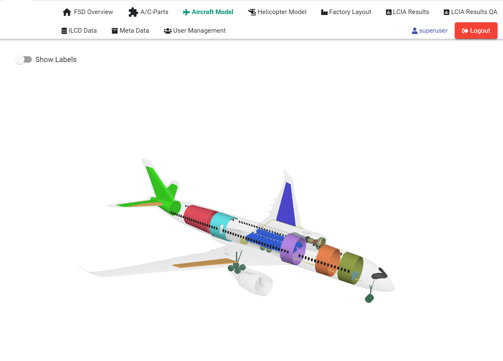
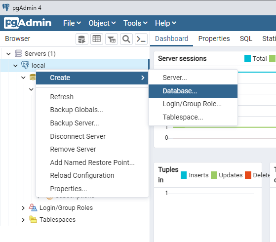
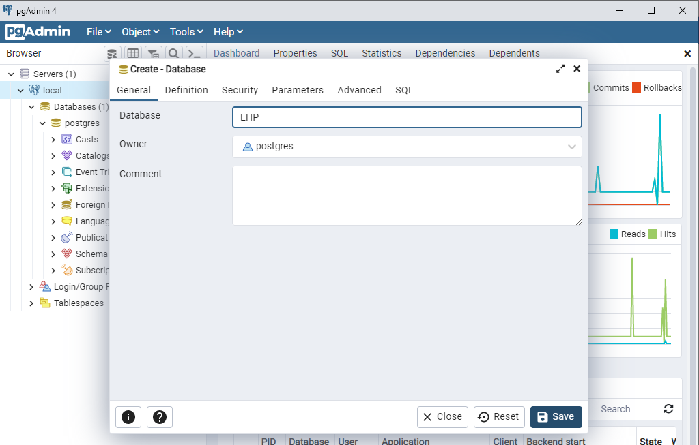
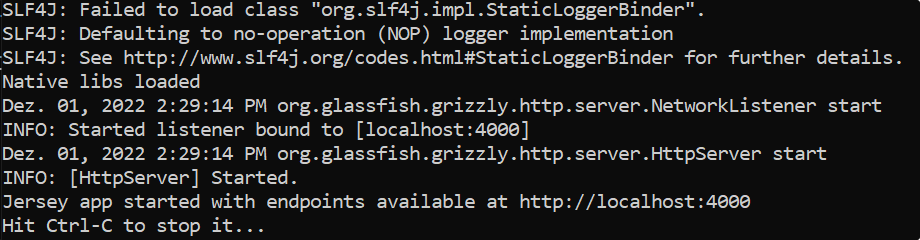

# Eco Hybrid Platform

The Eco Hybrid Platform (EHP) was developed as part of the EU project Cleansky 2 and enables the management of ILCD files and the comparison of LCIA impacts. Additionally, multiple LCIA processes in different assemblies can be combined and compared.



## License

EHP is provided here under the terms of the Gnu Public License (GPL) v. 3, see [`LICENSE.txt`](LICENSE.txt).
For alternate, non-copyleft licensing terms, please contact <daniel.weber@igd.fraunhofer.de>.


# Installation

## 1. Download and Install the following requirements:

[PostgreSQL](https://www.postgresql.org/download/windows/)   
- Download the installer and click next or change settings at will. It is required to set the password to '1234'. The Port needs to be 5432.
- When the installation is finished you need to create a new database named 'EHP'.
- To create the Database open pgAdmin. Right click the Server-Configuration that was created by the PostgreSQL-Installer and click on 'Database...'. Set the name of the database to 'EHP' afterwards.



[OpenJDK 17](https://adoptium.net/temurin/releases/?version=17) 
[Maven](https://maven.apache.org/download.cgi) 

[NodeJS LTS](https://www.nodejs.org)

[OpenLCA-Modules](https://github.com/GreenDelta/olca-modules) [commit: 53eb6935cd41b294c0488694139b36c019d22640]
- Note: to open the database database/OLCAProduction_2_0.zip OpenLCA 2.0 is required. 
- openLCA (https://www.openlca.org/download/)
  

## 2. Build openLCA Modules:

- Download olca modules (see above)
- be sure your local copy is commit 53eb6935cd41b294c0488694139b36c019d22640
- mvn install -DskipTests=true inside of the extracted olca-modules folder

## 3. Build and run OpenLCARest

### 3.1 Build

- To build OpenLCARest just run rebuild_OpenLCARest.bat from the repository.

Alternative:

- mvn install  inside of the \OpenLCARest folder of the EHP repository
- results in "[EHP-Repo-Root]\OpenLCARest\target\OpenLCAServer2-0.0.2-SNAPSHOT.jar"

To just run the OpenLCARest-Server while developing execute

- mvn clean install java:exec

### 4.2 Run

To run the OpenLCARest server, first you need to create a configuration file for the server. In this configuration file you specify folders where the server can upload files to. Also, you need to specify what OpenLCA-Database is used by the server. 
- Create folders upload\ and export\ somewhere.
- Extract the OpenLCA DerbyDB database\OLCAProduction_2_0.zip to a folder of your choice it contains the OpenLCA-Database for the OpenLCARest-Server.
- Open OpenLCARest\OpenLCAServer.ini in an editor and change upload-folder to the path of the upload\-folder you created.
- Set export-folder to the path of the export\-folder you created.
- Set database to the path of the folder you extracted from database/OLCAProduction_2_0.zip.
    
    **NOTE:** The folder you extracted from database/OLCAProduction_2_0.zip needs to contain the file README_DO_NOT_TOUCH_FILES.txt

    **ATTENTION:** Escape backslashes in windows-paths: for example C:\\\\test folder\\\\testfile.test

This is the configuration I created for my setup: (Example)
```ini
;OpenLCAServer Configuration-File
;
;Adjust Paths and remove the .example ending.
;Copy this into same folder as jar-file or
;specify this files location with -c option of
;the OpenLCAServer program.

[jetty]
port=4000
upload-folder=E:\\EHP\\upload
cors=true

[open-lca]
database=E:\\EHP\\OLCAProduction2
export-folder=E:\\EHP\\export
impact-method=ILCD 2011, endpoint [v1.0.10, August 2016]
use-native-lib=true

```
- The configuration file needs to be in the same folder the executable is in. If this is not the case you can specify the path of the configuration file with the -c option.
- If you are not using the prebuild binary of the OpenLCARest program start the server with the start_OpenLcaRest.bat executable.
- Otherwise run start_OpenLcaRest_prebuild.bat . If everything works you see this output: 



Alternative:

- start OpenLCAREST-Server by: java -jar OpenLCAServer2-0.0.2-SNAPSHOT-shaded.jar -c "<ini-file>"


## 5. Install NodeJS dependencies

- install angular cli: npm install -g @angular/cli
- rebuild_DatabaseRest.bat or npm install  inside DatabaseRest folder of the EHP repository
- rebuild_AngularApp or npm install  inside AngularApp folder of the EHP repository
- both folders will get a node_modules  sub folder

## 6. Initialize PostGreSQL Database (locally)

- execute database\initializeDBFunctions.bat in your EHP directory

## 7. Populate Postgresql database with data

The EHP-Repo provides an SQL dump of a SQL database that contains updated EHP metadata and links to the OpenLCA Database. You can find the SQL dump at database\ehp_prod_db_data_dump.sql (created by database\export_scripts\public_dump_data.bat) this dump is only valid with the OpenLCA database database\OLCAProduction_2_0.zip.

- Just run database\createReleaseDatabase.bat to import the sql dump to you EHP postgres database.

## 8. Start DatabaseRest

- node index.js  inside DatabaseREST folder or click start_DatabaseRest.bat

## 9. Start Angular App

- ng serve inside AngularApp folder or click start_AngularApp.bat

- Open the browser at
        http://localhost:4200/ 

        username :  superuser
        password:   superuser


